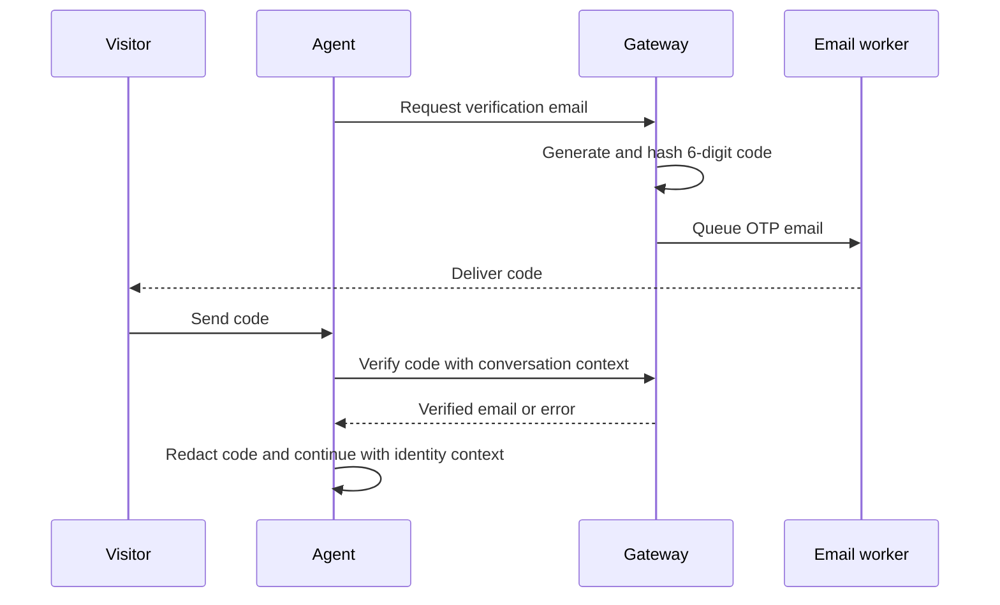

The AI agent can verify that a visitor controls an email address before using account-related tools. This is separate from operator login OTP and is stored as short-lived conversation metadata.

## OTP flow

Current controls include a 10-minute expiry, a 60-second resend cooldown, a maximum of five failed attempts, hashed code storage, and removal of the stored hash after success.

<Warning>
  Email control proves access to that mailbox at that moment. It does not prove legal identity, account ownership in another system, or authorization for irreversible actions.
</Warning>

## Contact conflicts

AI updates can discover a different proposed value for an existing contact. Rather than silently overwriting trusted fields, the contact service creates conflict records. Agents can list pending conflicts and either accept or dismiss a proposed value.

## Contact data operations

Agents can update contacts, add/edit/delete notes, manage tags individually or in bulk, delete selected contacts, and review conflicts. AI tools can seek or upsert contact context through secret-protected internal routes.

## Privacy safeguards

- Collect only fields enabled by widget policy.
- Never log OTP codes or raw provider credentials.
- Limit notes to support-relevant information.
- Use verified backend fields, not model summaries, for sensitive actions.
- Apply tenant scope to contact email/session uniqueness and every lookup.
