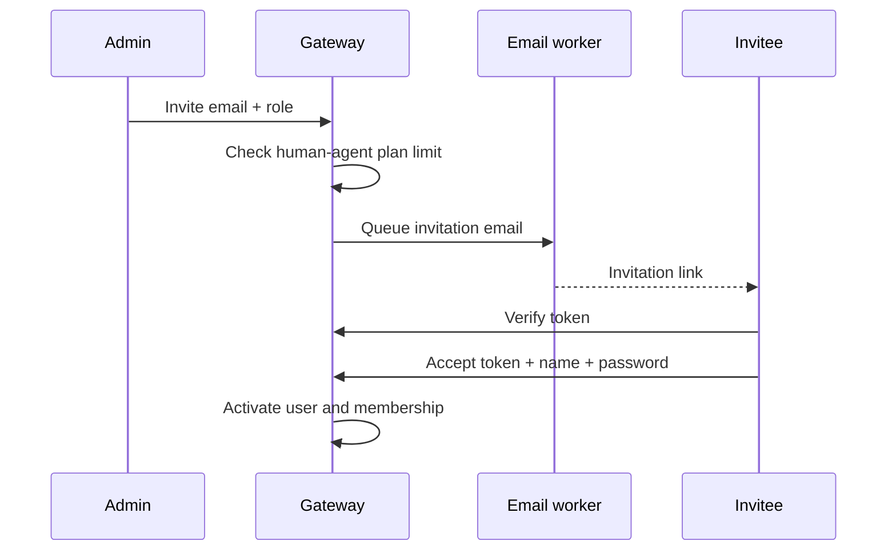

A membership grants one user a role in one organization. The database enforces one membership per user/organization pair.

## Roles

| Role | Typical access |
| --- | --- |
| `owner` | Full tenant administration, destructive organization operations, billing, QR ownership features |
| `admin` | Team, widget, channel, knowledge, templates, and organization settings |
| `agent` | Inbox, contacts, tickets, templates, profile/status, and support workflow |

Role middleware is hierarchical: routes that require `agent` are intended for support members at or above that capability, while higher-risk routes explicitly require `admin` or `owner`.

## Invitation flow

Memberships use `pending` or `accepted` invitation state and store inviter, invitation/expiry time, activation time, and optional permission strings.

## Administrative actions

Administrators can list members, invite, resend a pending invitation, change role, change status, and remove a member. Human-agent entitlement limits are checked when inviting.

<Warning>
  Preserve at least one active owner. Prevent administrators from promoting themselves to owner, demoting/removing an owner, or bypassing role policy through direct API calls.
</Warning>

## Troubleshooting invitations

- Confirm the platform worker and `platform-email` queue are healthy.
- In development, inspect MailHog instead of a real inbox.
- Use the newest link after resending; expired or previously consumed tokens should fail.
- Check tenant plan limits when an otherwise valid invitation is rejected.
