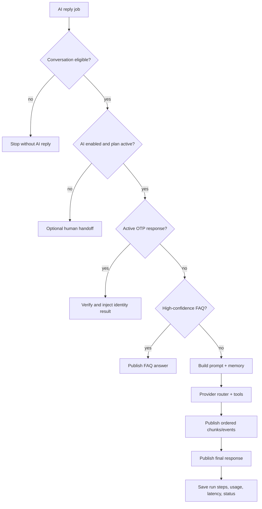

The chat-reply worker executes a defensive pipeline around model generation. It performs cheap, deterministic checks first and enters the model loop only when the conversation is eligible.

## Gates

<AccordionGroup>
  <Accordion title="Conversation state" icon="door-closed">
    Jobs are skipped when the conversation is already closed, escalated, or assigned to a person. This protects against delayed queue work producing an unwanted answer.
  </Accordion>
  <Accordion title="AI and subscription state" icon="badge-check">
    If AI is disabled or the subscription is expired, the pipeline can escalate to a human when widget/channel policy allows fallback.
  </Accordion>
  <Accordion title="Email OTP" icon="mail-check">
    A six-digit response is checked against the active contact-verification flow. Codes are redacted from logs and successful identity context is added to the prompt.
  </Accordion>
  <Accordion title="FAQ fast path" icon="zap">
    Question-like text is embedded and searched against tenant FAQ vectors. Matches at or above `0.85` bypass the model and return the stored answer.
  </Accordion>
</AccordionGroup>

## Context and generation

The context builder combines the system prompt, recent messages, turn count, organization/company information, channel, current page context when permitted, visitor-field policy, and tool policy. `CHAT_HISTORY_LIMIT` bounds recent history, while longer-lived summaries can be retrieved through the memory tool.

The selected provider reports capabilities. Streaming is enabled only when supported, and tools are supplied only to models that support tool calling. The fallback router can try an ordered provider path and captures usage where available.

## Output guarantees

Stream publications are serialized per conversation/message and carry sequence values. The final response waits for pending stream writes, preventing the completion event from overtaking earlier chunks. A provider exception produces safe user copy and may trigger a human handoff.

<Tip>
  For debugging, correlate gateway and agent logs with `conversationId`, `messageId`, and the gateway's `x-request-id`. The console exposes agent-run steps for supported assist and conversation views.
</Tip>
