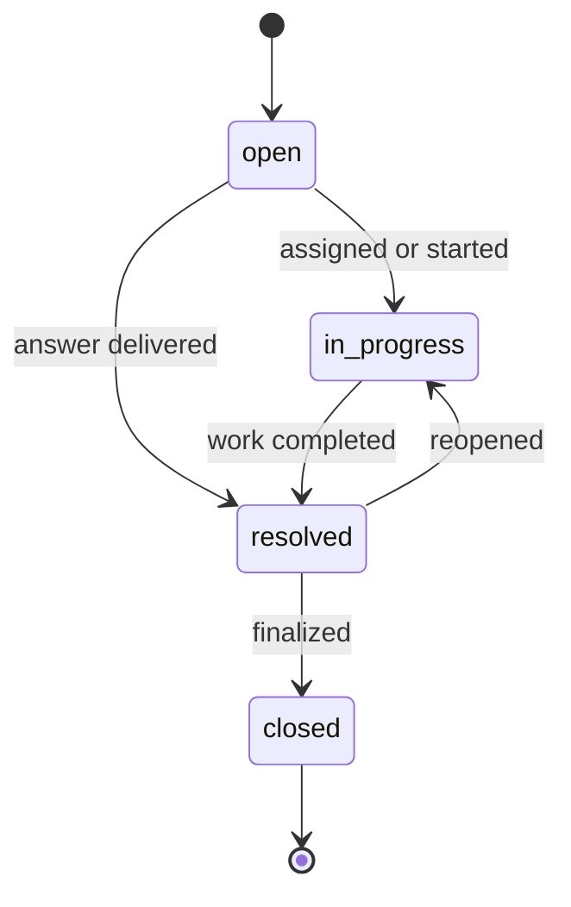

Tickets convert a conversation request into durable support work. They carry a title, description, status, priority, origin, assignee, tags, notes, resolution metadata, and links back to the conversation/contact when available.

## AI actions

| Tool | Purpose |
| --- | --- |
| `create_ticket` | Create a ticket from a request that needs follow-up |
| `get_ticket_status` | Report current status without guessing |
| `update_ticket` | Change supported ticket fields or add progress |
| `close_ticket` | Close completed work with resolution context |

Internal AI routes use `AI_TOOL_SECRET`, while operator routes use JWT authentication, organization resolution, and agent role checks. The console exposes ticket lists, detail, assignment, status updates, notes, and replies.

## Ticket lifecycle

Priorities are `low`, `medium`, `high`, or `urgent`. Origins include widget, email, WhatsApp, Telegram, operator roles, AI, and API.

## Idempotency and traceability

Ticket storage includes an idempotency-key index in metadata, which AI and integrations should use when retries could create duplicate work. Notes record author and author type. Agent-run steps should link tool execution to the originating conversation and message.

<Warning>
  Models should not claim that a ticket was created, updated, or closed until the tool returns success. User-facing ticket identifiers must come from the gateway response.
</Warning>
