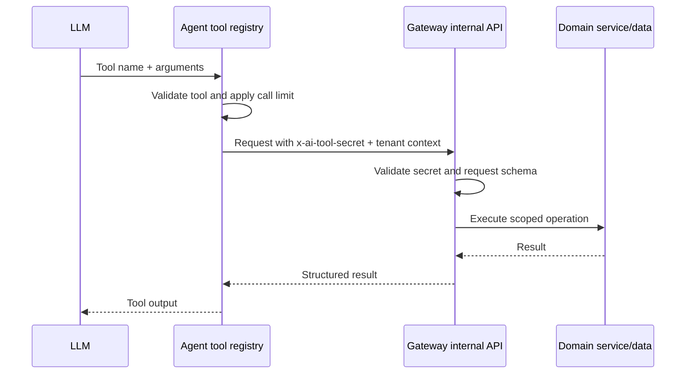

Tools let a capable model retrieve approved context or perform controlled support actions. InteraOne supplies tools according to channel and widget policy, then executes them with organization, conversation, and message context.

## Built-in tools

<Columns cols={2}>
  <Card title="Knowledge and reasoning" icon="search">
    `knowledge_retrieval`, `faq_retrieval`, `web_crawl`, `rewrite_and_think`, and `conversation_memory`.
  </Card>
  <Card title="Tickets" icon="ticket-check">
    `create_ticket`, `get_ticket_status`, `update_ticket`, and `close_ticket`.
  </Card>
  <Card title="Contacts and identity" icon="contact">
    `seek_contact`, `update_contact_profile`, and `verify_email_otp`.
  </Card>
  <Card title="Workflow" icon="handshake">
    `escalate_to_human`, `mark_query_resolved`, `save_unanswered_question`, and `send_email`.
  </Card>
</Columns>

## Execution path

The tool utility layer caps repeated calls to prevent runaway loops. Tool events can be streamed to the console for transparency and stored as agent-run steps.

## Add a tool safely

<Steps>
  <Step title="Define one narrow action">
    Give the tool an unambiguous name, a precise description, and the smallest useful argument schema.
  </Step>
  <Step title="Validate at both boundaries">
    Validate model arguments in the agent and independently validate/authenticate the internal gateway request.
  </Step>
  <Step title="Scope by tenant and conversation">
    Never let the model choose an unrestricted organization identifier. Derive context from the job and verify records belong to it.
  </Step>
  <Step title="Design idempotency and confirmation">
    Make repeatable writes safe. Require explicit user confirmation for destructive, financial, identity, or externally visible actions.
  </Step>
  <Step title="Record useful telemetry">
    Capture duration, success, a redacted result summary, and a stable error category without logging credentials or personal secrets.
  </Step>
</Steps>

<Warning>
  `AI_TOOL_SECRET` authenticates the service, not the end user's intent. Domain services must still enforce policy and protect sensitive actions.
</Warning>
