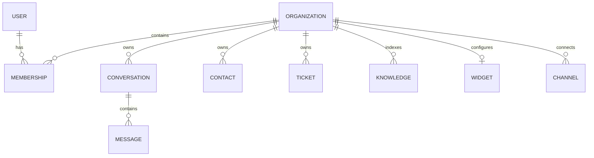

MongoDB is the durable system of record and the gateway uses Mongoose models. Most business collections include `organizationId`, which is the primary tenant partition and must be present in queries and indexes.

## Core collections

| Area | Models |
| --- | --- |
| Identity | `User`, `Organization`, `Membership` |
| Support | `Conversation`, `Message`, `Contact`, `ContactConflict`, `Ticket`, `Template` |
| AI and knowledge | `Knowledge`, `UnansweredQuestion`, `SystemEvent` |
| Channels | `Widget`, `Channel`, `EmailTemplate`, `Notification` |
| Billing and limits | `BillingSubscription`, `BillingCheckoutIntent`, `BillingWebhookEvent`, `UsageRecord` |

## Relationship highlights

Conversations use `open`, `resolved`, and `closed` states and carry priority, assignment, tags, channel, and session context. Messages are stored separately and indexed by conversation/time. Tickets use `open`, `in_progress`, `resolved`, and `closed` states.

## Index and retention behavior

- Compound indexes support organization/status, assignment, channel, email, and recency queries.
- Membership is unique per user and organization.
- Contacts are unique by organization/session and sparsely unique by organization/email.
- A tenant can have at most one channel of each type.
- System events use a 90-day TTL index for observability retention.
- Checkout intents expire automatically after their configured lifecycle.

<Warning>
  Never query a tenant-owned collection by record ID alone in user-facing code. Combine the ID with resolved organization context to avoid cross-tenant access.
</Warning>

## Backup guidance

Back up MongoDB consistently with the matching object-storage data. Test restores into an isolated environment, validate indexes after restore, and document recovery point and recovery time objectives before production launch.
