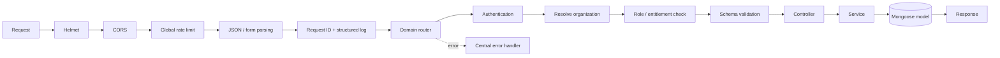

`apps/gateway` is the system's synchronous control plane. It exposes `/api/v1`, hosts Socket.IO, validates identity and tenant context, persists domain state, produces background work, consumes AI streams, and serves non-production Swagger UI.

## Request lifecycle

Not every route uses every middleware. Public auth, webhook, widget, and AI-internal routes have purpose-built security checks.

## Domain modules

| Module | Responsibilities |
| --- | --- |
| `auth` | Signup, OTP, login, password recovery, refresh, logout, profile |
| `organization` / `membership` | Tenant lifecycle, switching, invitations, roles, status |
| `conversation` / `contacts` | Inbox, messages, routing, memory, identity, agent assist |
| `tickets` / `templates` | Ticket workflow, notes, replies, saved responses |
| `knowledge` / `storage` | Knowledge metadata, upload confirmation, reindexing, object URLs |
| `widget` / `channels` | Widget configuration, sessions, QR entry, channel adapters and webhooks |
| `notifications` / `analytics` / `observability` | Operator events, metrics, and AI call summaries |

## Runtime dependencies

The service refuses startup if MongoDB or Redis cannot connect. MinIO initialization is non-blocking and retries on first use. It also seeds built-in email templates, starts AI-response and assist-response consumers, then listens on `0.0.0.0:3002` by default.

<AccordionGroup>
  <Accordion title="REST and health" icon="heart-pulse">
    The API is mounted at `/api/v1`; `/api/v1/health` is the operational health route. `/` returns product and version metadata.
  </Accordion>
  <Accordion title="Socket.IO" icon="radio">
    Separate agent and widget handlers share middleware for authentication, subscription policy, and connection gating. Redis supports cross-process messaging and AI response consumption.
  </Accordion>
  <Accordion title="Internal AI calls" icon="shield">
    Agent tools call selected gateway endpoints using `x-ai-tool-secret`. This shared secret is distinct from user JWTs and must remain private to the service network.
  </Accordion>
</AccordionGroup>

## Scaling notes

- Run multiple stateless gateway replicas behind a WebSocket-capable load balancer.
- Share MongoDB, Redis, MinIO, and the same JWT/internal secrets across replicas.
- Preserve forwarded client IP configuration because the app trusts the first proxy for rate limiting.
- Coordinate database indexes and seed behavior during rolling deployments.
