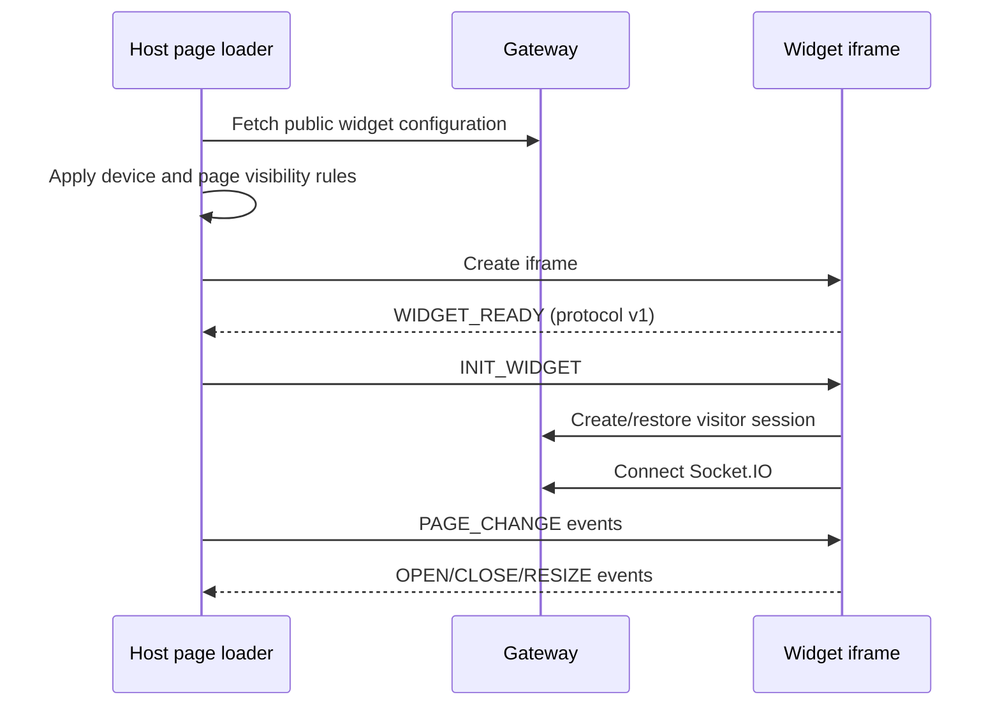

`apps/launcher` builds two browser artifacts: a small host-page loader and the iframe application that renders chat. This split isolates customer CSS and JavaScript from the widget UI while allowing a controlled exchange of page and sizing context.

## Security properties

- All protocol messages include version `1`; unknown versions are ignored.
- Both sides validate `event.origin` and the expected window before handling messages.
- Production messages use a specific target origin instead of `*`.
- The public key selects configuration but is not an administrator credential.
- Widget tokens scope the visitor connection separately from operator JWTs.
- Host-page DOM access can be disabled. When enabled, extracted semantic text is cleaned and capped before it crosses the iframe boundary.

## Configurable behavior

The widget model supports theme, colors, placement, logos, welcome copy, visibility rules, mobile/desktop switches, auto-open, AI enablement, fallback to an agent, visitor field collection, host DOM access, and quick suggestions.

<Note>
  The loader watches History API changes and `popstate`, so page visibility and context can stay current in single-page applications without reloading the script.
</Note>

## Artifact delivery

In local development, `make widget-deploy` builds and uploads the launcher assets to MinIO. In production, the Compose stack runs `launcher-deploy` as a one-shot service and serves the resulting assets through the configured CDN host.

See [web widget](/channels/web-widget) for installation and operator-facing configuration.
