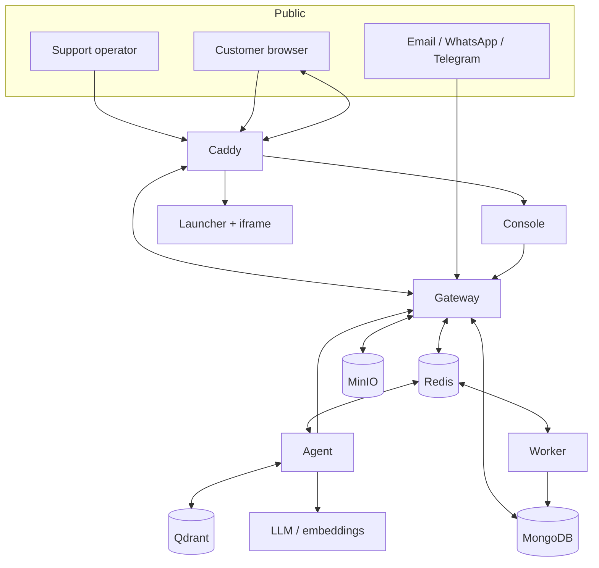

InteraOne is a pnpm/Turborepo monorepo organized as deployable applications rather than a single process. The gateway owns synchronous domain operations, the agent owns AI workloads, the worker owns platform background jobs, the console is the operator UI, and the launcher is the customer-facing widget.

## Architectural principles

<CardGroup cols={2}>
  <Card title="Tenant-scoped data" icon="building-2">
    Organizations are the tenant boundary. Domain records and authorization decisions carry organization context.
  </Card>
  <Card title="Async by default for heavy work" icon="list-todo">
    AI generation, ingestion, email, analytics, and subscription maintenance run through Redis-backed jobs or streams.
  </Card>
  <Card title="Provider adapters" icon="plug-zap">
    Model, embedding, and email integrations sit behind factories or adapters so deployments can choose providers.
  </Card>
  <Card title="Open-core entitlements" icon="key-round">
    The gateway and console evaluate plan policy; licensed worker behavior starts only when enterprise mode is enabled.
  </Card>
</CardGroup>

## Communication matrix

| From | To | Mechanism | Typical data |
| --- | --- | --- | --- |
| Console | Gateway | HTTPS + Socket.IO | Auth, administration, inbox state, live events |
| Launcher | Gateway | HTTPS + Socket.IO | Widget config, visitor sessions, messages |
| Gateway | Agent | BullMQ/Redis streams | Reply, ingestion, analysis, and assist jobs |
| Agent | Gateway | Internal HTTP + Redis | Tool calls, run logs, streaming chunks, final replies |
| Gateway | Worker | BullMQ | Email and analytics jobs |
| Gateway/worker | MongoDB | Mongoose | Tenant and operational records |
| Agent | Qdrant | REST | Tenant-filtered vector upserts and searches |
| Gateway/agent | MinIO | S3-compatible API | Uploads, source documents, widget assets |

<Info>
  See [request flow](/architecture/request-flow) for the runtime sequence and the individual service pages for code layout and scaling characteristics.
</Info>
