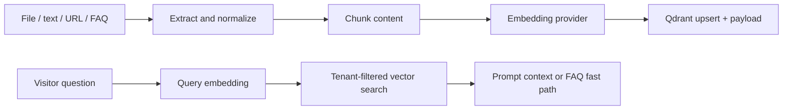

Qdrant stores vector representations produced by the configured embedding provider. The agent uses it for knowledge retrieval and a high-confidence FAQ fast path.

## Stored context

Each point combines an embedding with payload metadata such as organization, document/source identity, source type, chunk content, and FAQ answer fields. Search always needs an organization filter so one tenant's knowledge cannot appear in another tenant's prompt.

## Retrieval modes

<Tabs>
  <Tab title="Knowledge">
    The `knowledge_retrieval` tool requests the top relevant chunks, limited by `RAG_TOP_K`, and returns their text and metadata to the model.
  </Tab>
  <Tab title="FAQ fast path">
    Question-like messages search FAQ vectors before the LLM loop. A top result with a score of at least `0.85` can be returned directly, reducing latency and model cost.
  </Tab>
</Tabs>

## Model changes

Vector collections have a fixed dimension. Defaults in source include 1024 for Bedrock Titan v2, 768 for Ollama `nomic-embed-text`, 384 for Hugging Face MiniLM, and 1536 for OpenAI `text-embedding-3-small`; configuration can override these.

<Warning>
  When changing embedding provider, model, or dimension, rebuild the collection and reindex every source. Mixing embeddings from incompatible models produces invalid comparisons even when dimensions happen to match.
</Warning>

Use the agent's `inspect:vectors`, `debug:qdrant`, and `reset:vectors` scripts for controlled diagnostics. Resetting vectors is destructive and must be followed by reindexing.
