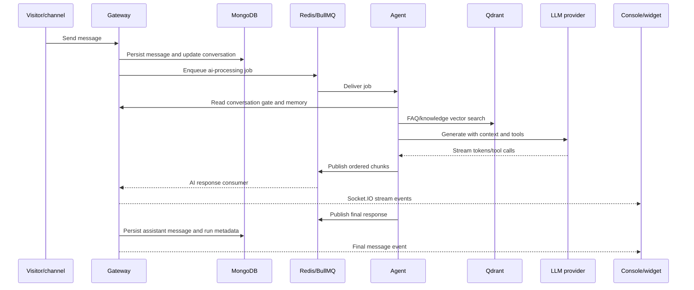

The exact ingress adapter varies by channel, but messages converge on a tenant-scoped conversation and share the same AI and human-support model.

## Pipeline checkpoints

<Steps>
  <Step title="Authenticate or establish visitor context">
    Operators use a JWT with an active organization. Widget clients exchange a public widget key and visitor context for a scoped widget token.
  </Step>
  <Step title="Persist before processing">
    The gateway creates or updates the conversation and stores the message so the inbox and AI process share the same durable state.
  </Step>
  <Step title="Run AI gates">
    The agent skips closed, escalated, or human-assigned conversations; checks AI/subscription availability; handles an active email OTP; and attempts an exact FAQ fast path.
  </Step>
  <Step title="Build context and generate">
    The agent combines a system prompt, recent conversation memory, tenant settings, channel context, and an eligible tool set. A provider router handles generation and fallback.
  </Step>
  <Step title="Stream and finalize">
    Ordered chunks and tool events travel through Redis to gateway consumers. The final response is persisted and an agent-run record captures timing, usage, steps, and errors.
  </Step>
</Steps>

## Human path

If a gate or tool escalates the conversation, or model generation fails while fallback is enabled, the gateway marks it for human support. Subsequent AI jobs are rejected by the conversation gate. An operator can then route, reply, change status, add notes, use templates, or invoke agent-assist features from the console.

<Warning>
  Queue delivery can be retried. Producers and consumers should preserve idempotency keys or stable message identifiers whenever side effects are possible.
</Warning>
