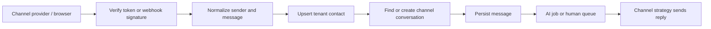

Channels normalize customer messages into organization-scoped contacts, conversations, and messages. Once normalized, the same inbox, AI pipeline, tickets, routing, analytics, and human-handoff behavior can serve every source.

| Channel | Inbound transport | Outbound transport | Identity key |
| --- | --- | --- | --- |
| Web widget | HTTPS + Socket.IO | Socket.IO | Stable/ephemeral visitor session |
| Email | AWS SES/SNS webhook | Configured email adapter | Sender address/thread metadata |
| WhatsApp | Twilio webhook | Twilio Messages API | `whatsapp-<phone>` session |
| Telegram | Telegram webhook | Bot API | `telegram-<chatId>` session |
| QR/direct link | Hosted `/c/:publicKey` page | Widget transport | Widget visitor session plus source attribution |

<CardGroup cols={2}>
  <Card title="Web widget" icon="message-circle" href="/channels/web-widget">
    Iframe-isolated chat with configurable appearance, visibility, AI, and visitor fields.
  </Card>
  <Card title="Email" icon="mail" href="/channels/email">
    Domain-verified support addresses and inbound/outbound email.
  </Card>
  <Card title="WhatsApp" icon="message-square" href="/channels/whatsapp">
    Twilio-backed WhatsApp messages with signed inbound webhooks.
  </Card>
  <Card title="Telegram" icon="send" href="/channels/telegram">
    Bot token verification, webhook registration, and chat mapping.
  </Card>
</CardGroup>

## Shared lifecycle

Administrators manage channels; agents consume the resulting conversations. One organization can have one saved channel per type under the current unique index.

<Warning>
  Webhook routes are public by necessity. Treat provider signature verification, HTTPS, secret rotation, replay/idempotency controls, and minimal error responses as mandatory production controls.
</Warning>
