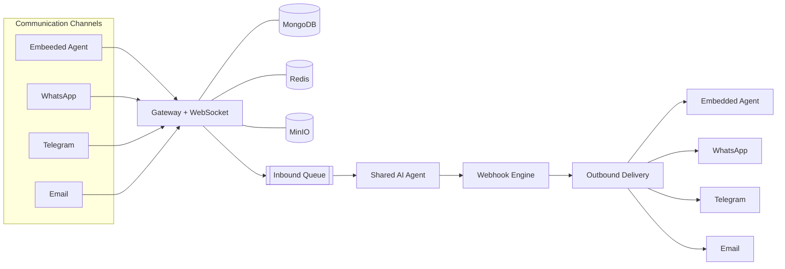

InteraOne is an open-source, multi-tenant customer-support platform that combines a shared inbox, tickets, contacts, knowledge retrieval, an embeddable widget, messaging channels, and AI agents in one deployable system.

Our mission is to unify every customer communication channel with a single shared AI brain that businesses fully own and control. We empower organizations to build, self-host, and scale intelligent support without vendor lock-in.

<CardGroup cols={2}>
  <Card title="Run it locally" icon="rocket" href="/quickstart">
    Start the complete development stack with pnpm, Docker, and one Make target.
  </Card>

  <Card title="Self-host in production" icon="server" href="/self-hosting/overview">
    Deploy InteraOne to Production with a One-Click Server Setup
  </Card>

  <Card title="Understand the architecture" icon="blocks" href="/architecture/overview">
    Follow requests across the gateway, queues, AI agent, worker, and data stores.
  </Card>

  <Card title="Explore the Agent" icon="brain" href="/ai/agent-pipeline">
    Understand how a single shared brain is decoupled to handle inbound and outbound communication across all channels.
  </Card>
</CardGroup>

## What the platform includes

<Columns cols={3}>
  <Card title="AI assistance" icon="bot">
    Provider routing, streaming replies, RAG, tools, agent assist, and human handoff.
  </Card>

  <Card title="Support operations" icon="inbox">
    Conversations, assignment, contacts, tickets, templates, notifications, and analytics.
  </Card>

  <Card title="Customer channels" icon="messages-square">
    Web widget, email, WhatsApp, Telegram, QR entry points, and direct links.
  </Card>
</Columns>

## System at a glance

The repository is a pnpm/Turborepo monorepo. Its five application packages have deliberately separate responsibilities:

| Application | Responsibility |
| --- | --- |
| `apps/gateway` | Express REST API, Socket.IO, authorization, domain modules, storage, and queue producers/consumers |
| `apps/console` | Vite \+ React operator dashboard for conversations, tickets, contacts, knowledge, channels, widgets, and settings |
| `apps/launcher` | Iframe-isolated browser widget loader and widget UI bundle |
| `apps/agent` | AI reply, ingestion, analysis, assist, tool execution, model routing, and vector retrieval |
| `apps/worker` | Email delivery, analytics persistence, any background processing |

<Info>
  The source repository contains an open-core `ee/` area. Features loaded from it are governed by `ee/LICENSE` and runtime entitlement checks; review that license before commercial use.
</Info>

## Choose your path

<Tabs>
  <Tab title="Evaluate">
    Follow the [quickstart](/quickstart), sign up through the local console, configure a model provider, add knowledge, and embed the widget on a test page.
  </Tab>
  <Tab title="Operate">
    Start with [self-hosting architecture](/self-hosting/architecture), then configure environment variables, Caddy, persistent volumes, backups, and monitoring.
  </Tab>
  <Tab title="Contribute">
    Read the [contributor overview](/contributing/overview), run the focused checks for the package you change, and open a scoped pull request.
  </Tab>
</Tabs>

<Tip>
  Search understands page titles, headings, descriptions, and code. Press <kbd>⌘ K</kbd> or <kbd>Ctrl K</kbd> to find a feature quickly.
</Tip>