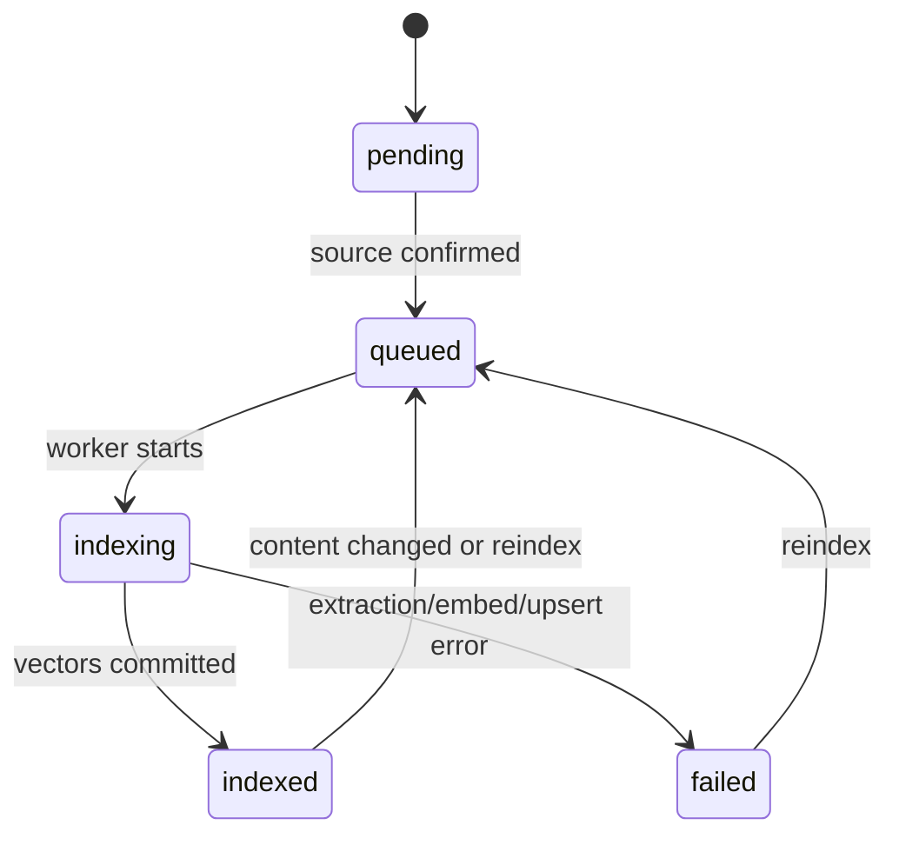

The knowledge base turns approved organization content into searchable vector chunks. Administrators manage source metadata through the gateway; the agent performs asynchronous extraction, chunking, embedding, and Qdrant upserts.

## Supported source types

<CardGroup cols={2}>
  <Card title="Files" icon="files" href="/knowledge-base/ingesting-files">
    Upload PDF and DOCX documents through presigned object-storage URLs.
  </Card>
  <Card title="Text" icon="text">
    Store authored text directly without an object-storage round trip.
  </Card>
  <Card title="URLs" icon="globe" href="/knowledge-base/ingesting-urls">
    Index one page or crawl related pages with depth and sync settings.
  </Card>
  <Card title="FAQs" icon="circle-help" href="/knowledge-base/ingesting-faqs">
    Index question/answer pairs for retrieval and the high-confidence fast path.
  </Card>
</CardGroup>

## Source lifecycle

Knowledge records can also be paused. They store title, description, catalog, source type, file/source metadata, sync policy, word and chunk counts, last indexed time, and an error message when processing fails.

## Processing pipeline

<Steps>
  <Step title="Create source metadata">
    The authenticated administrator creates text/URL/FAQ metadata or requests a presigned file upload.
  </Step>
  <Step title="Queue ingestion">
    Confirmation or creation produces a `document-ingestion` BullMQ job with stable document and organization context.
  </Step>
  <Step title="Extract and normalize">
    Source-specific pipelines stream text from MinIO, authored content, a URL fetch/crawl, or FAQ pairs.
  </Step>
  <Step title="Chunk and embed">
    Content is divided into bounded units and embedded with retry and concurrency controls.
  </Step>
  <Step title="Upsert and report status">
    Vectors and payloads are written to Qdrant, then the agent reports counts and status to the gateway using `AI_TOOL_SECRET`.
  </Step>
</Steps>

<Warning>
  Only index content you are authorized to process. Crawled pages and uploaded documents may contain personal data, secrets, or copyrighted material that should not be exposed to the model.
</Warning>
