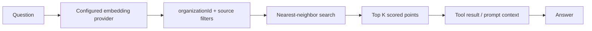

Vector search compares the embedding of a visitor's question with stored source chunks. It retrieves semantically related material even when the wording differs.

## Query flow

`RAG_TOP_K` defaults to `5` in the agent configuration. FAQ prechecks request only the top result and apply a `0.85` threshold. Normal knowledge retrieval can use multiple chunks to assemble context.

## Relevance levers

| Lever | Effect |
| --- | --- |
| Source quality | Clean, authoritative text produces the largest improvement |
| Chunk size and overlap | Balances precise matches against enough surrounding context |
| Embedding model | Controls semantic representation, language support, dimensions, and cost |
| Metadata filters | Prevent cross-tenant results and narrow by source/type when appropriate |
| `RAG_TOP_K` | Trades context breadth for token use and irrelevant results |
| FAQ threshold | Controls direct-answer precision |

## Diagnose poor results

<AccordionGroup>
  <Accordion title="No results">
    Confirm the source is `indexed`, vectors exist for the document, the query uses the same embedding dimension, and organization identifiers match in both record and payload.
  </Accordion>
  <Accordion title="Wrong source wins">
    Inspect duplicate content, headings lost during extraction, overly broad chunks, stale vectors, and missing catalog/type filters.
  </Accordion>
  <Accordion title="Relevant result but poor answer">
    Separate retrieval quality from generation quality. Inspect returned payload text first, then the system prompt, tool output formatting, and selected chat model.
  </Accordion>
</AccordionGroup>

<Warning>
  A vector similarity score is not a factual confidence score. The answer pipeline still needs source attribution, policy constraints, and tools for live account data.
</Warning>
