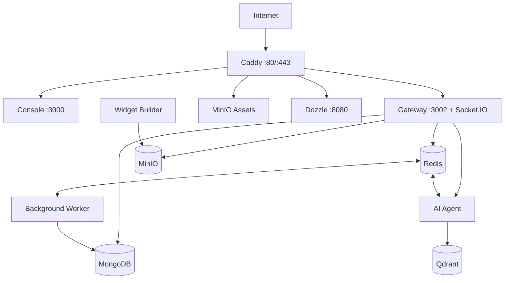

InteraOne is built on a **modular microservices architecture** where every core component is independently deployable and loosely coupled through queues, events, and well-defined APIs.

For simplicity, the open-source edition ships as a **single-host Docker Compose deployment**, allowing you to run the entire platform with one command. As your workload grows, the same services can be deployed independently across multiple machines or Kubernetes without changing the application architecture.

## Deployment Models

InteraOne supports multiple deployment strategies using the same codebase.

### Monolithic Deployment

Ideal for:

- Development
- Small teams
- Self-hosted installations
- Single-server deployments

All services run together through Docker Compose while remaining logically separated.

### Microservices Deployment

Ideal for:

- Production
- High availability
- Large organizations
- Horizontal scaling

Each service can be deployed independently and scaled according to its workload.

For example:

- Multiple Gateway instances
- Dedicated AI Agent clusters
- Separate Worker pools
- Managed MongoDB
- Managed Redis
- External object storage
- External vector database

Because services communicate through Redis, queues, and APIs, scaling one service does not require scaling the others.

## Required Hosts

| Variable | Purpose |
| --- | --- |
| `API_HOST` | Gateway REST API and Socket.IO |
| `WEB_HOST` | Console application |
| `CDN_HOST` | Widget assets and public objects |
| `LOG_HOST` | Dozzle log viewer |

When using real domain names, Caddy automatically provisions TLS certificates through Let's Encrypt.

## Persistent Storage

InteraOne persists data across multiple services.

| Service | Stores |
| --- | --- |
| MongoDB | Application data and metadata |
| Redis | Cache, queues, pub/sub, sessions |
| MinIO | Uploaded files and widget assets |
| Qdrant | AI embedding vectors |

All persistent storage should be included in your backup strategy.

## Scaling

As traffic grows, externalize stateful services first:

- MongoDB
- Redis
- MinIO
- Qdrant

Then scale stateless services independently:

- Gateway
- AI Agent
- Worker

Every Gateway instance should share the same Redis instance and signing secrets to support Socket.IO communication and distributed processing.

<Warning>
  The reference Docker Compose deployment binds most internal services to the local host for additional protection. This should complement—not replace—proper firewall rules, private networking, and infrastructure security.
</Warning>