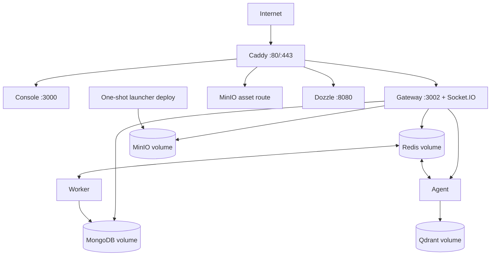

The production Compose file is a single-host reference deployment. Caddy is the only intended public entry point; application and data services communicate on a private Docker network.

## Required hosts

| Variable | Routes |
| --- | --- |
| `API_HOST` | REST API and Socket.IO |
| `WEB_HOST` | Console SPA; can equal `API_HOST` for path-based single-domain routing |
| `CDN_HOST` | Widget and public object assets |
| `LOG_HOST` | Dozzle log UI; restrict more heavily than the public app |

Caddy automatically obtains TLS certificates for real domain names. With a plain IP it serves HTTP. Create DNS records before startup so certificate validation can succeed.

## Persistent state

The Compose stack declares volumes for MongoDB, Redis, MinIO, Qdrant, and Caddy. Back up all data stores on a coordinated schedule. MongoDB contains source metadata while MinIO contains file bytes and Qdrant contains derived vectors; losing only one produces incomplete state.

## Scaling boundary

The provided stack favors operational simplicity. For larger installations, externalize stateful services first, then scale gateway, agent, and worker separately based on request, AI, and queue load. Ensure Socket.IO coordination and every replica share Redis and signing secrets.

<Warning>
  The production Compose file binds database and application ports to loopback where host access is useful. Keep cloud firewalls closed for those ports; loopback binding is defense in depth, not a replacement for network policy.
</Warning>
